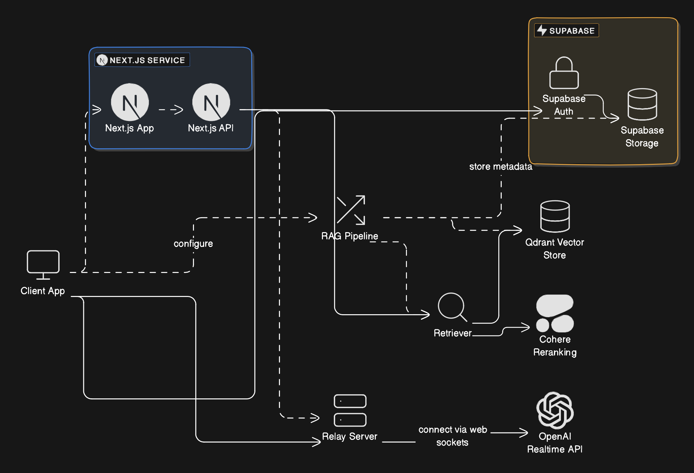

<p align="center">

<br>
<em>DocTalk: Where Your Voice Brings Documents to Life</em>
<br><br>
<a title="Releases" target="_blank" href="https://github.com/noohfaisal/voice-chat-pdf/releases"></a>
<a title="Downloads" target="_blank" href="https://github.com/noohfaisal/voice-chat-pdf/releases"></a>
<br>
<a title="Hits" target="_blank" href="https://github.com/noohfaisal/voice-chat-pdf">
    
</a>
<a title="Code Size" target="_blank" href="https://github.com/noohfaisal/voice-chat-pdf">
    
</a>
<a title="GitHub Pull Requests" target="_blank" href="https://github.com/noohfaisal/voice-chat-pdf/pulls">
    
</a>
<br>
<a title="GitHub Commits" target="_blank" href="https://github.com/noohfaisal/voice-chat-pdf/commits/master">
    
</a>
<a title="Last Commit" target="_blank" href="https://github.com/noohfaisal/voice-chat-pdf/commits/master">
    
</a>

## Table of Contents

* [📄 Voice Chat with PDFs](#voice-chat-with-pdfs)
* [⚙️ Prerequisites](#prerequisites)
* [🔮 Features](#-features)
* [🏗️ Architecture](#%EF%B8%8F-architecture)
* [🔑 OpenAI API Key](#-openai-api-key)
* [🚀 Performance Improvements](#-performance-improvements)
* [🚀 Getting Started](#getting-started)
* [💬 Using the Console](#using-the-console)
* [📚 Learn More](#learn-more)


This is a [LlamaIndex](https://www.llamaindex.ai/) project using [Next.js](https://nextjs.org/)

## Voice Chat with PDFs

This is a an example based on the [openai/openai-realtime-console](https://github.com/openai/openai-realtime-console),
extending it with a simple RAG system using [LlamaIndexTS](https://ts.llamaindex.ai).

## Prerequisites

The project requires an OpenAI API key (**user key** or **project key**) that has access to the
Realtime API. Set the key in the `.env` file or as an environment variable `OPENAI_API_KEY`.

## 🔮 Features

Most features are free, even for commercial use.

- [x] **User Authentication**
  - Sign up and sign in with user credentials for secure access.

- [x] **Document Upload**
  - Upload documents for interaction.
  - Preview mode to review documents before uploading.

- [x] **Embedding Documents**
  - Generate embeddings for uploaded documents.
  - Set top-k parameters for optimized query results.
  - Machine searches through generated embeddings to return relevant chunks.

- [x] **Interactive Playground**
  - Engage with documents using voice commands.
  - Choose between **Push-to-Talk** or **Open Mic** interaction modes.
  - Receive voice responses from the machine for a seamless experience.
     
## 🏗️ Architecture

<p align="center">
  
</p>

### Key Components Overview

1. **Next.js Service (App & API)**
   - **Next.js App:** This is the frontend layer, which provides the user interface where users can interact with the system, including uploading documents and querying them via voice interaction.
   - **Next.js API:** The backend service that handles API requests from the frontend, processes user requests (like document uploads), and interacts with other services such as the RAG (Retrieval-Augmented Generation) pipeline.

2. **Supabase**
   - **Supabase Auth:** Manages user authentication and authorization for secure access to document-related features.
   - **Supabase Storage:** Stores uploaded documents and associated metadata, ensuring secure access and scalability for user data.

3. **RAG Pipeline (Retrieval-Augmented Generation)**
   - The **RAG pipeline** is the core of the system's retrieval capabilities. It processes user queries, searches through stored embeddings (generated from uploaded documents), and fetches relevant document chunks to provide a context-aware response. This is done via:
     - **Retriever:** Fetches relevant document sections based on the query.
     - **Cohere Reranking:** Enhances the relevance of retrieved document sections to provide more accurate results.

4. **Vector Store (Qdrant)**
   - **Qdrant Vector Store:** This is where document embeddings are stored after the document upload. Embeddings are numerical representations of document chunks that allow the system to efficiently search and retrieve relevant information based on user queries.

5. **Relay Server**
   - Acts as an intermediary between the **Client App** and the **OpenAI Realtime API**, managing real-time communication and user interaction. It facilitates the WebSocket connections needed for voice interaction.

6. **OpenAI Realtime API**
   - Provides AI-driven responses by interacting with the user’s queries in real time. The system sends the retrieved context from the document (via the RAG pipeline) to OpenAI’s API, which generates voice responses based on the document content.

### Interaction Flow

1. **Client App (Frontend):** The user uploads a document and interacts with it through the app.
2. **Document Storage (Supabase):** The document is stored securely, and metadata is captured.
3. **Embedding Generation (RAG Pipeline):** The document is processed, embeddings are generated, and stored in the **Qdrant Vector Store**.
4. **Query Handling (Retriever & Cohere):** When a user queries the document, relevant chunks are retrieved using the embeddings.
5. **Response Generation (OpenAI API):** The retrieved chunks are passed to the **OpenAI API**, which generates a response that is returned to the user through the **Client App**.

This architecture ensures seamless interaction, real-time voice responses, and efficient document handling, making **DocTalk** a robust platform for document-based AI interactions.

## 🔑 OpenAI API Key

- **Required for Document Interaction**
  - An OpenAI API key is necessary for generating embeddings and enabling voice interactions.
  - Enter your API key in the interactive playground to start using voice commands with your documents.

## 🚀 Performance Improvements

Our goal is to continuously enhance the interaction experience between the user and the model by reducing inference time and improving overall responsiveness.

- **Optimized Model Inference**  
  We’ve made significant optimizations to reduce the time it takes for the model to process user queries and return responses. These improvements are aimed at providing a smoother, near real-time interaction experience.

- **Parallel Processing**  
  By leveraging parallel processing, the system can handle multiple queries or larger documents without slowing down. This ensures quicker response times, especially when dealing with complex documents or longer conversations.


## Getting Started

First, install the dependencies:

```
npm install
```

Second, generate the embeddings of the documents in the `./data` directory:

```
npm run generate
```

The example PDF is about physical letter standards, you can use your own documents.

Third, run the development server:

```
npm run dev
```

Open [http://localhost:3000](http://localhost:3000) with your browser to see the result.

## Using the console

You'll be prompted on startup to enter the API key again (this needs to be fixed).

To start a session you'll need to **connect**. This will require microphone access.
You can then choose between **manual** (Push-to-talk) and **vad** (Voice Activity Detection)
conversation modes, and switch between them at any time.

You can freely interrupt the model at any time in push-to-talk or VAD mode.

## Learn More

To learn more about LlamaIndex, take a look at the following resources:

- [LlamaIndex Documentation](https://docs.llamaindex.ai) - learn about LlamaIndex (Python features).
- [LlamaIndexTS Documentation](https://ts.llamaindex.ai) - learn about LlamaIndex (Typescript features).

You can check out [the LlamaIndexTS GitHub repository](https://github.com/run-llama/LlamaIndexTS) - your feedback and contributions are welcome!
