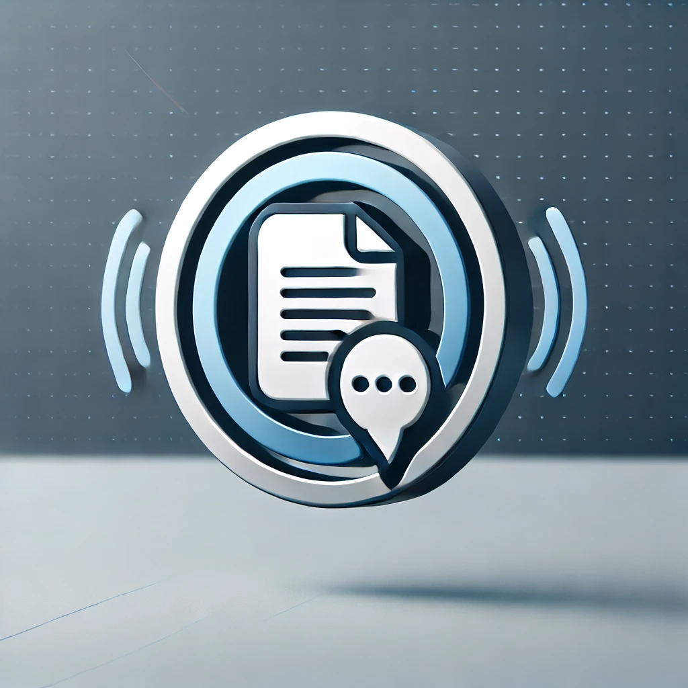

<p align="center">

<br>
<em>DocTalk: Where Your Voice Brings Documents to Life</em>
<br><br>
<a title="Releases" target="_blank" href="https://github.com/noohfaisal/voice-chat-pdf/releases"></a>
<a title="Downloads" target="_blank" href="https://github.com/noohfaisal/voice-chat-pdf/releases"></a>
<br>
<a title="Hits" target="_blank" href="https://github.com/noohfaisal/voice-chat-pdf">
    
</a>
<a title="Code Size" target="_blank" href="https://github.com/noohfaisal/voice-chat-pdf">
    
</a>
<a title="GitHub Pull Requests" target="_blank" href="https://github.com/noohfaisal/voice-chat-pdf/pulls">
    
</a>
<br>
<a title="GitHub Commits" target="_blank" href="https://github.com/noohfaisal/voice-chat-pdf/commits/master">
    
</a>
<a title="Last Commit" target="_blank" href="https://github.com/noohfaisal/voice-chat-pdf/commits/master">
    
</a>

## Table of Contents

* [📄 Voice Chat with PDFs](#voice-chat-with-pdfs)
* [⚙️ Prerequisites](#prerequisites)
* [🔮 Features](#-features)
* [🔑 OpenAI API Key](#-openai-api-key)
* [🚀 Getting Started](#getting-started)
* [💬 Using the Console](#using-the-console)
* [📚 Learn More](#learn-more)


This is a [LlamaIndex](https://www.llamaindex.ai/) project using [Next.js](https://nextjs.org/)

## Voice Chat with PDFs

This is a an example based on the [openai/openai-realtime-console](https://github.com/openai/openai-realtime-console),
extending it with a simple RAG system using [LlamaIndexTS](https://ts.llamaindex.ai).

## Prerequisites

The project requires an OpenAI API key (**user key** or **project key**) that has access to the
Realtime API. Set the key in the `.env` file or as an environment variable `OPENAI_API_KEY`.

## 🔮 Features

Most features are free, even for commercial use.

- **User Authentication**
  - Sign up and sign in with user credentials for secure access.

- **Document Upload**
  - Upload documents for interaction.
  - Preview mode to review documents before uploading.

- **Embedding Documents**
  - Generate embeddings for uploaded documents.
  - Set top-k parameters for optimized query results.
  - Machine searches through generated embeddings to return relevant chunks.

- **Interactive Playground**
  - Engage with documents using voice commands.
  - Choose between **Push-to-Talk** or **Open Mic** interaction modes.
  - Receive voice responses from the machine for a seamless experience.

## 🔑 OpenAI API Key

- **Required for Document Interaction**
  - An OpenAI API key is necessary for generating embeddings and enabling voice interactions.
  - Enter your API key in the interactive playground to start using voice commands with your documents.


## Getting Started

First, install the dependencies:

```
npm install
```

Second, generate the embeddings of the documents in the `./data` directory:

```
npm run generate
```

The example PDF is about physical letter standards, you can use your own documents.

Third, run the development server:

```
npm run dev
```

Open [http://localhost:3000](http://localhost:3000) with your browser to see the result.

## Using the console

You'll be prompted on startup to enter the API key again (this needs to be fixed).

To start a session you'll need to **connect**. This will require microphone access.
You can then choose between **manual** (Push-to-talk) and **vad** (Voice Activity Detection)
conversation modes, and switch between them at any time.

You can freely interrupt the model at any time in push-to-talk or VAD mode.

## Learn More

To learn more about LlamaIndex, take a look at the following resources:

- [LlamaIndex Documentation](https://docs.llamaindex.ai) - learn about LlamaIndex (Python features).
- [LlamaIndexTS Documentation](https://ts.llamaindex.ai) - learn about LlamaIndex (Typescript features).

You can check out [the LlamaIndexTS GitHub repository](https://github.com/run-llama/LlamaIndexTS) - your feedback and contributions are welcome!
